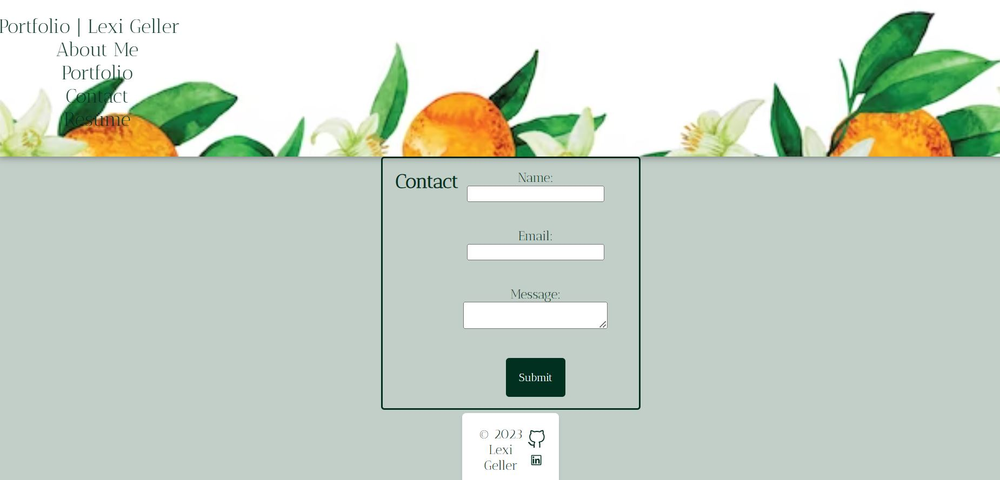

# React-Portfolio

## Description

A current portfolio that utilizes React.

## Installation and Usage

Type ```npm run install``` into the CLI to install necessary packages. To start the server, run ```npm run start```. From there, open the [deployed application](https://lexigeller.github.io/React-Portfolio/) in a browser.



## Technologies Used

* Webpack
* Babel
* React
* Google Fonts API
* Node.js

## Credits

N/A

## License

Please refer to the LICENSE in the repo.